# RH Manager

[](https://github.com/LeopratesDev/rh-manager/actions/workflows/ci.yml)

Sistema de gestão de RH com cadastro de funcionários e departamentos e solicitação de férias com fluxo de aprovação.
API REST em **C# / ASP.NET Core (.NET 10)** com **SQL Server**, e painel web em **React + TypeScript**.

**Demo online:** https://leopratesdev.github.io/rh-manager/ · [documentação da API](https://rh-manager-api-nmsbk.azurewebsites.net/scalar/v1)
Use os [usuários de demonstração](#usuários-de-demonstração). O primeiro acesso pode levar cerca de 1 minuto, porque a API e o banco ficam em planos gratuitos que "dormem" quando estão sem uso.

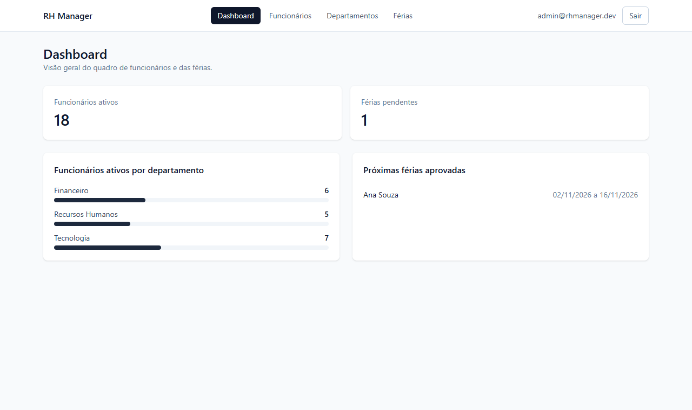

| Funcionários | Férias (colaborador) |
|---|---|
| 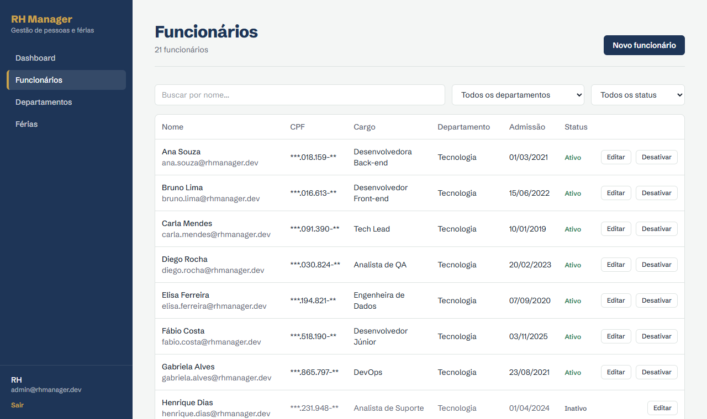 | 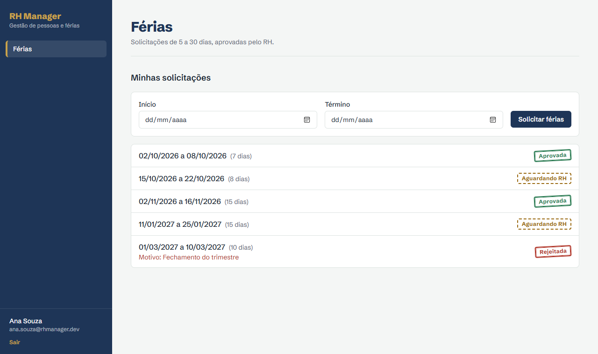 |
| **Aprovações (RH)** | **Celular** |
| 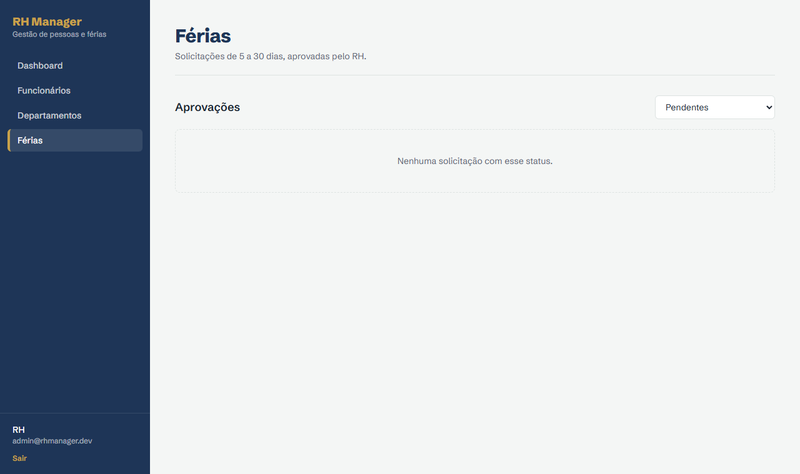 | 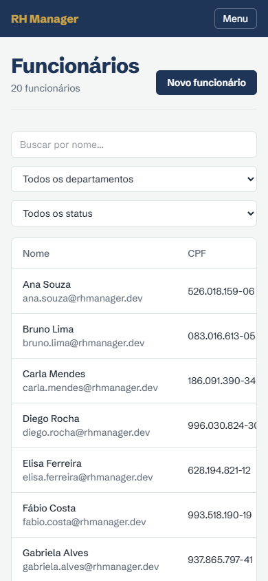 |

<details>
<summary>Mais telas: login, edição de funcionário e departamentos</summary>

| Login | Editar funcionário | Departamentos |
|---|---|---|
| 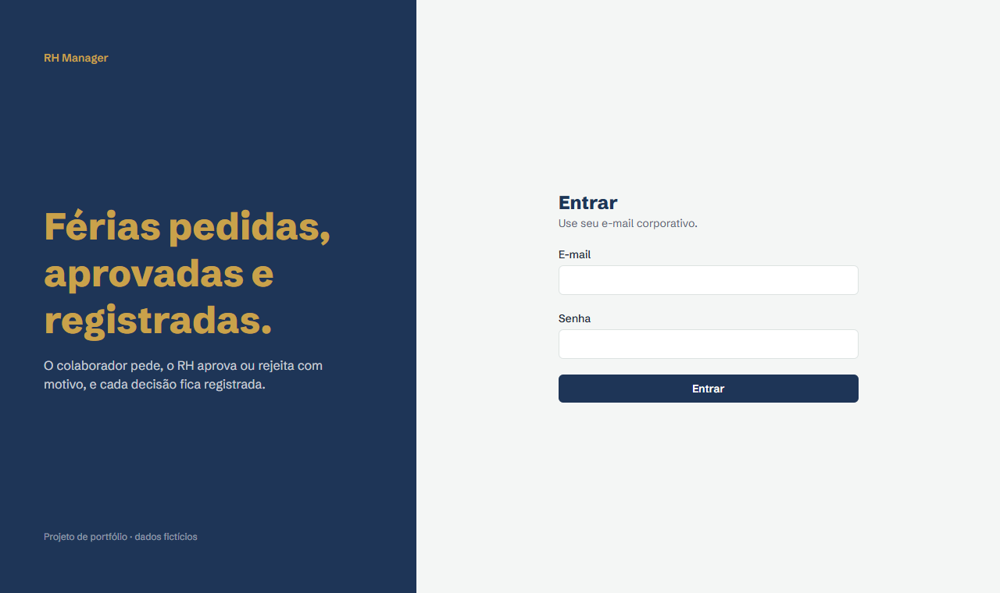 | 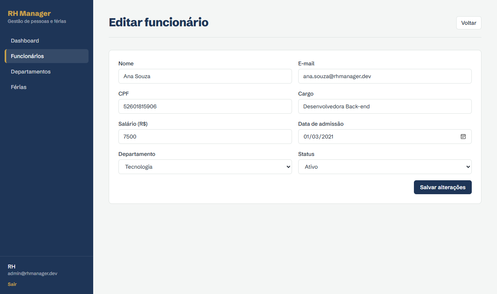 | 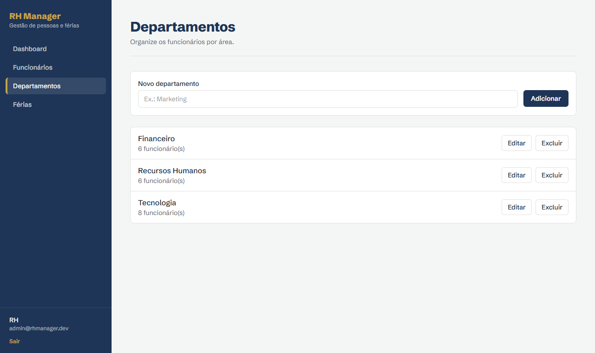 |

</details>

## Em números

- **21 endpoints REST**, com erros padronizados em ProblemDetails (RFC 7807).
- **146 testes automatizados:** 32 unitários e 68 de integração na API, mais 46 no front.
- **5 telas:** Login, Dashboard, Funcionários, Departamentos e Férias.
- **3 jobs de CI** em cada push e PR (API, Web e Docker), e **deploy contínuo** para o Azure e o GitHub Pages.

## Tecnologias

| Camada | Tecnologias |
|---|---|
| API | C# 14, ASP.NET Core 10 (Controllers), Entity Framework Core 10, SQL Server, FluentValidation, JWT Bearer, OpenAPI + Scalar |
| Front | React 19, TypeScript (strict), Vite, React Router, TanStack Query, React Hook Form + Zod, Tailwind CSS, axios |
| Testes | xUnit, FluentAssertions, WebApplicationFactory + SQLite em memória, Vitest, Testing Library |
| Infra | Docker Compose, GitHub Actions, Azure App Service, Azure SQL, GitHub Pages, EditorConfig, `dotnet format`, ESLint, Prettier |

## Funcionalidades

- **Autenticação com JWT** e dois papéis:
  - `Admin` (RH) pode tudo;
  - `Employee` (colaborador) vê o próprio perfil e pede férias.
- **Departamentos:** CRUD. A exclusão é bloqueada quando o departamento tem funcionários.
- **Funcionários:** CRUD com e-mail e CPF únicos e CPF validado pelos dígitos verificadores. A listagem é paginada, com busca por nome e filtro por departamento e status. Excluir apenas inativa o funcionário, para preservar o histórico.
- **Férias**, com fluxo Pendente → Aprovada/Rejeitada. Regras:
  - de 5 a 30 dias por solicitação;
  - sem sobrepor outra solicitação pendente ou aprovada do mesmo funcionário;
  - só depois de 12 meses de admissão;
  - não pode começar no passado;
  - só o Admin aprova ou rejeita, e a rejeição exige motivo.
- **Dashboard:** funcionários ativos por departamento, férias pendentes e próximas férias aprovadas.

## Como rodar

### Com Docker (recomendado)

Pré-requisito: [Docker Desktop](https://www.docker.com/products/docker-desktop/).

```bash
git clone https://github.com/LeopratesDev/rh-manager.git
cd rh-manager
cp .env.example .env    # troque a senha do SQL Server e a chave JWT
docker compose up --build
```

| Serviço | Endereço |
|---|---|
| Painel web | http://localhost:3000 |
| API | http://localhost:5000 |
| Documentação da API (Scalar) | http://localhost:5000/scalar/v1 |
| Health check | http://localhost:5000/health |

A API espera o SQL Server ficar saudável, aplica as migrations e cria os dados de demonstração sozinha.

### Sem Docker

Pré-requisitos: .NET SDK 10, Node 22 e SQL Server (o LocalDB serve).

```bash
# API
cd api
cp src/RhManager.Api/appsettings.Development.example.json src/RhManager.Api/appsettings.Development.json
dotnet user-secrets set "Jwt:Key" "uma-chave-aleatoria-com-pelo-menos-32-caracteres" --project src/RhManager.Api
dotnet run --project src/RhManager.Api          # http://localhost:5138

# Front (em outro terminal)
cd web
cp .env.example .env
npm install
npm run dev                                      # http://localhost:5173
```

## Usuários de demonstração

Criados pelo seed, só em ambiente de desenvolvimento.

| Perfil | E-mail | Senha |
|---|---|---|
| Admin (RH) | `admin@rhmanager.dev` | `Admin@123` |
| Colaborador | `ana.souza@rhmanager.dev` | `Colab@123` |

O seed também cria 3 departamentos e 20 funcionários fictícios (18 ativos e 2 inativos).

## Arquitetura

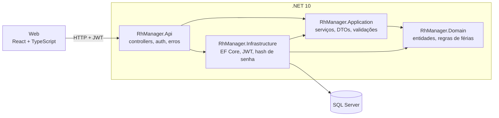

**Por que essa estrutura?** As dependências apontam para dentro: o `Domain` não conhece banco nem HTTP, então as regras de férias são testáveis como funções puras. A `Application` define interfaces (`IAppDbContext`, `ITokenService`, `IPasswordHasher`) que a `Infrastructure` implementa. Não usei CQRS, MediatR nem repositórios genéricos: para um CRUD com um fluxo de aprovação, eles adicionariam arquivos e indireção sem resolver um problema real. O `DbContext` do EF Core já funciona como Unit of Work e repositório.

## Modelo de dados

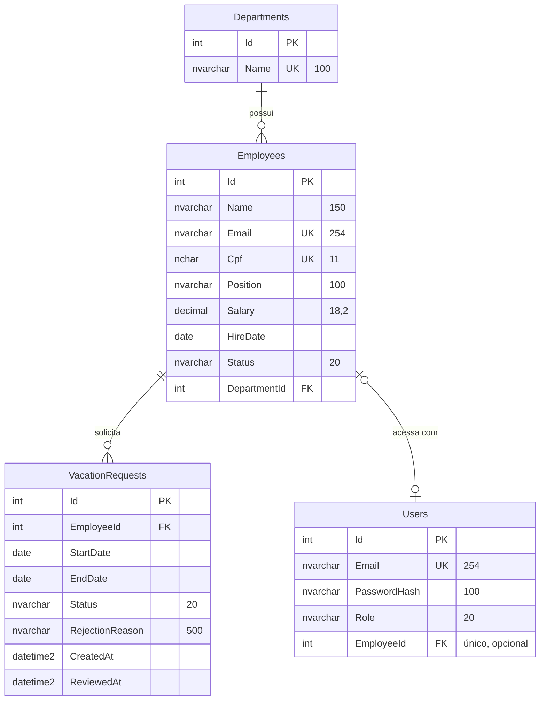

Todas as chaves estrangeiras usam `ON DELETE RESTRICT`: apagar um departamento nunca apaga funcionários em cascata. Os enums são salvos como texto, para serem legíveis direto no banco.

## Endpoints principais

| Método | Rota | Acesso | Respostas |
|---|---|---|---|
| POST | `/api/auth/login` | público | 200, 400, 401 |
| GET | `/api/auth/me` | autenticado | 200, 401 |
| GET | `/api/departments` | Admin | 200 |
| POST | `/api/departments` | Admin | 201 + Location, 400, 409 |
| PUT/DELETE | `/api/departments/{id}` | Admin | 204, 400, 404, 409 |
| GET | `/api/employees?page=1&pageSize=10&search=&departmentId=&status=` | Admin | 200 com `totalItems` e `totalPages` |
| POST | `/api/employees` | Admin | 201 + Location, 400, 409 (e-mail/CPF) |
| GET/PUT/DELETE | `/api/employees/{id}` | Admin | 200/204, 400, 404, 409 |
| GET | `/api/employees/me` | autenticado | 200, 404 |
| POST | `/api/vacations` | colaborador | 201, 400 (regras), 403, 409 (sobreposição) |
| GET | `/api/vacations/mine` | colaborador | 200 |
| GET | `/api/vacations?status=&employeeId=` | Admin | 200 |
| GET | `/api/vacations/{id}` | Admin ou o dono | 200, 403, 404 |
| POST | `/api/vacations/{id}/approve` | Admin | 204, 404, 409 |
| POST | `/api/vacations/{id}/reject` | Admin | 204, 400 (sem motivo), 404, 409 |
| GET | `/api/dashboard` | Admin | 200 |
| GET | `/health` | público | 200 |

Documentação completa, com schemas e o botão para colar o token, em `/scalar/v1`.

## Testes

```bash
cd api && dotnet test          # 32 unitários + 68 de integração
cd web && npm test             # 46 testes
```

- **Unitários (xUnit):** cada regra de férias com pelo menos 1 caso de sucesso e 1 de falha, as transições de status, a validação de CPF e os validadores.
- **Integração:** `WebApplicationFactory` sobe a API inteira em memória, roda o seed real e faz login de verdade. Cobrem status HTTP, paginação, conflitos, autorização por papel (401/403), CORS e o dashboard.
- **Front (Vitest + Testing Library):** formulário de funcionário, login, rotas protegidas, cliente HTTP (401), férias e dashboard.
- **Mutações manuais:** em cada etapa, quebrei o código de propósito (por exemplo, `<=` virando `<` na sobreposição) para confirmar que algum teste falhava. Duas mutações sobreviveram e revelaram testes fracos, que foram corrigidos.

**Por que SQLite em memória nos testes de integração, e não Testcontainers?** Roda em qualquer máquina e no CI sem Docker, e a suíte inteira leva cerca de 3 s. O custo é que o SQLite difere do SQL Server em detalhes; por exemplo, a busca diferencia maiúsculas de minúsculas. Para compensar, cada etapa também foi testada manualmente contra o SQL Server real, e o `docker compose up` sobe o banco de verdade.

## Decisões técnicas e trade-offs

- **Erros num único lugar:** os serviços lançam exceções de negócio (`NotFound`, `Conflict`, `Forbidden`, `ValidationException`), e o `GlobalExceptionHandler` as converte em ProblemDetails com o status HTTP correto. Os controllers ficam com uma ou duas linhas.
- **Duplicidade checada duas vezes:** o serviço confere e-mail e CPF para devolver um 409 com mensagem clara, e o índice único do banco garante a regra mesmo com requisições simultâneas.
- **Segurança por padrão:** `MapControllers().RequireAuthorization()` exige login em todas as rotas; só `/login` e `/health` são abertos. Esquecer um `[Authorize]` deixa a rota fechada, não aberta.
- **Senhas:** usam o `PasswordHasher` do ASP.NET Identity (PBKDF2 com salt). A `Jwt:Key` fica fora do repositório (`user-secrets` ou variável de ambiente), e a API não sobe sem ela.
- **Token no `localStorage` em vez de cookie httpOnly:**
  - é mais simples e sobrevive ao recarregar a página, mas um XSS conseguiria ler o token;
  - as mitigações são o token expirar em 60 minutos, o React escapar HTML por padrão e o projeto não usar `dangerouslySetInnerHTML`;
  - o cookie httpOnly protegeria contra XSS, mas exigiria proteção contra CSRF, CORS com credenciais e mudança no login. Está em "próximos passos".
- **Datas:** `DateOnly` na API e datas de calendário (`YYYY-MM-DD`) no front, sem `new Date()`, que em UTC-3 transformaria 15/03 em 14/03.
- **Tailwind em vez de Material UI:** CSS final de cerca de 7 kB, controle do layout e interface sem cara de template.

### SOLID na prática

1. **Inversão de dependência (D):** `EmployeeService` depende de `IAppDbContext`, e `AuthService` depende de `ITokenService` e `IPasswordHasher`. As implementações (EF Core, JWT e Identity) ficam na `Infrastructure` e podem ser trocadas sem mexer nas regras.
2. **Responsabilidade única (S):**
   - `VacationPolicy` só decide se um período é válido;
   - `VacationService` só orquestra banco e regras;
   - `GlobalExceptionHandler` só traduz exceções em HTTP.
3. **Aberto/fechado (O):** cada configuração de tabela é uma classe `IEntityTypeConfiguration<T>`, carregada por `ApplyConfigurationsFromAssembly`. Uma entidade nova não exige alterar o `AppDbContext`.

## Deploy

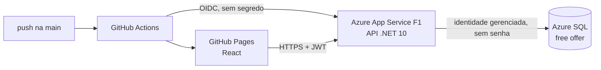

| Parte | Onde | Custo |
|---|---|---|
| Front | GitHub Pages (`deploy-web.yml`) | grátis |
| API | Azure App Service **F1 (Free)**, Linux (`deploy-api.yml`) | grátis |
| Banco | Azure SQL Database, **free offer** com *auto-pause* ao atingir o limite mensal | grátis, sem cobrança por excedente |

- **Zero segredos no repositório.** O GitHub Actions entra no Azure por **federação OIDC**:
  - a cada execução, o GitHub emite um token de curta duração;
  - o Microsoft Entra ID só aceita o token vindo deste repositório, no ambiente `production`;
  - a identidade de deploy tem o papel *Website Contributor* **só no Web App**.
- **Banco sem senha.** A API conecta com `Authentication=Active Directory Managed Identity`. A identidade do Web App tem apenas `db_ddladmin`, `db_datareader` e `db_datawriter` (menor privilégio). O servidor SQL aceita só login do Microsoft Entra.
- **Configuração por variáveis de ambiente** no App Service: `ConnectionStrings__Default`, `Jwt__Key`, `Cors__AllowedOrigins__0`, `ApiDocs__Enabled` e `Database__MigrateAndSeedOnStartup`. A chave JWT existe só lá.
- **Migrations no startup** (`Database:MigrateAndSeedOnStartup`): como há uma única instância, é a opção mais simples. Com várias instâncias, elas iriam para um passo separado do pipeline.
- **Verificação automática:** cada deploy termina chamando `/health` e falha se a API não responder.

## Estrutura

```
rh-manager/
├── api/
│   ├── src/
│   │   ├── RhManager.Api/              controllers, middleware de erros, auth, Program.cs
│   │   ├── RhManager.Application/      serviços, DTOs, validadores, interfaces
│   │   ├── RhManager.Domain/           entidades, enums, VacationPolicy
│   │   └── RhManager.Infrastructure/   DbContext, configurações, migrations, seed, JWT
│   └── tests/
│       ├── RhManager.UnitTests/
│       └── RhManager.IntegrationTests/
├── web/src/
│   ├── api/          cliente HTTP, tipos e tratamento de erros
│   ├── components/   layout, campos e estados de loading, vazio e erro
│   ├── features/     auth, dashboard, departments, employees, vacations
│   └── lib/          CPF, datas e formatação
├── docker-compose.yml
└── .github/workflows/ci.yml
```

## Próximos passos

- Refresh token e armazenamento do token em cookie httpOnly com proteção CSRF.
- Rate limiting no login.
- Transformar o 500 de uma violação de índice único (em requisições simultâneas) em 409, e proteger o pedido de férias contra corrida com uma transação serializável.
- Testcontainers com SQL Server na suíte de integração.
- Testes de ponta a ponta com Playwright.

## Autor

**Leonardo Prates**: [LinkedIn](https://www.linkedin.com/in/leonardo-prates77/) · lp.prates7@gmail.com
